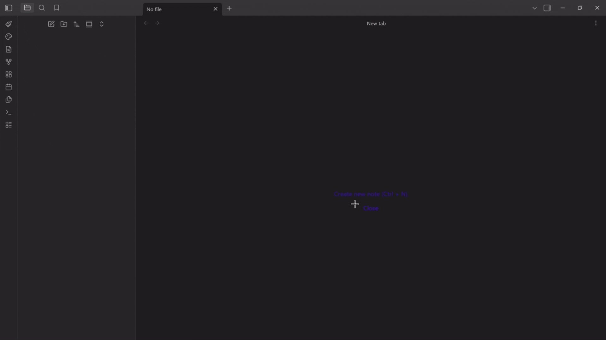

# v i b g y o r

> **Customize your Obsidian notes with unique colors and patterns.**

Give each note its own personality — apply custom page colors, text colors, link colors, accent colors, and background patterns through a simple visual interface or frontmatter properties.

---

## Features

- **Per-note theming** — Set unique background, text, link, and accent colors for individual notes
- **Background patterns** — Apply textures like Grid, Blueprint, Cosmos, Starfield, Zen Waves, and more
- **Image color matching** — Automatically tints transparent-background images to match your note's pen color, with a one-click toggle to view originals
- **10 built-in presets** — Ready-to-use themes including Dark Mode, Vampire, Nord Dark, Neon Noir, and more
- **Custom palettes** — Create and save your own reusable color combinations
- **Real-time updates** — Changes to frontmatter are applied instantly

---

## Getting Started


### Ribbon Icons & Usage
The plugin provides two main entry points in your left ribbon:

| Icon | Name | Purpose |
| :--- | :--- | :--- |
|  | **Create Themed Note** | Opens a modal to name a new note and pick its initial theme/pattern. |
|  | **Edit Active Theme** | Modifies the theme and pattern of the note you are currently viewing. |

---

### Creating a Themed Note

Use the **Paintbrush** ribbon icon or the command palette (`Create themed note`) to open the creation modal:

1. Enter a **note title**
2. Pick a **theme type** — Minimal, Advanced, or Custom Palettes
3. Choose a **preset** or define **custom colors** (page, link, accent, pen)
4. Select a **background pattern** (optional)
5. Click **Create note** 
  


---

### Editing an Existing Note's Theme

1. Navigate to the **Edit active note theme** at the left sidebar.
2. Pick the new **theme type** and the **new palette** or **custom colors**.
3. Modify as your wish.
4. Click on **Save theme** button to apply the changes.


---

### Create Custom Palettes

1. Navigate to the obsidian **setting tab**.
2. Under **community plugins** search for **v i b g y o r**, hit the setting icon.
3. Under **Custom palettes**, click **Add custom palette** name it and define your own color combinations.
4. Navigate back to the Edit active theme tab, select Custom Palettes and use your custom colors.


---

### Image Color Toggle

When a note has a theme applied, images with transparent backgrounds are automatically tinted to match the pen color, and if you don't have image with transparent background you can paste the default image.
 Hover over any image to reveal a toggle button at the top-left corner of image:

- Click to **view original colors**
- Click again to **re-apply theme tinting**

The plugin remembers your choice per image.


> [!IMPORTANT]
> 🎨 The image recoloring feature works best with [Inkporter](https://github.com/AmadeussSystem/Inkporter) — a fantastic plugin by AmadeussSystem. If you enjoy that feature, go show their repo some love! ⭐

---

## Built-in Theme Presets

| Theme | Palette Preview (Page, Pen, Link, Accent) |
|:---|:---|
| **Dark Mode** |  |
| **Light Mode** |  |
| **Vampire** |  |
| **Sepia** |  |
| **Nord Dark** |  |
| **Neon Noir** |  |
| **Crimson Ember** |  |
| **Twilight Harbor** |  |
| **Imperial Noir** |  |
| **Midnight Mint** |  |

---

## Background Patterns

Patterns are organized into three categories:

### Note / Paper
| Pattern | Description |
|:---|:---|
| Lined | Horizontal ruled lines |
| Dotted | Evenly spaced dot grid |
| Grid | Square grid overlay |
| Cornell | Ruled lines with a left margin |
| Blueprint | Fine + coarse grid (engineering style) |

### Geometric
| Pattern | Description |
|:---|:---|
| Woven | 45° crosshatch texture |
| Hexagonal | Sci-fi hexagonal grid |

### Artistic / Space
| Pattern | Description |
|:---|:---|
| Cosmos | Scattered stars and sparkles |
| Starfield | Dense 4-pointed star field |
| Zen Waves | Concentric ripple circles |
| Cyber Maze | Thick maze-like corridors |
| Cyber Circuit | Circuit board traces with nodes |

---

## Settings

Open **Settings** → **v i b g y o r** to manage your theme library:

- **Custom palettes** — Create, edit, and delete your own color combinations
- **Minimal themes** — View built-in preset themes (read-only)
- **Advanced themes** — Coming soon

---

## Frontmatter Reference

The plugin reads and writes these frontmatter properties:

```yaml
---
theme-name: "Vampire Palette"   # Name of the selected preset
page-pattern: "grid"            # Background pattern
page-color: "#1a1a1a"           # Page background (custom colors only)
pen-color: "#ffffff"            # Text color (custom colors only)
link-color: "#3366cc"           # Link color (custom colors only)
accent-color: "#ff9900"         # Headings & accent (custom colors only)
grid-color: "#333333"           # Pattern grid color (optional)
---
```

> **Note:** When using a preset, only `theme-name` and `page-pattern` are stored. The colors are resolved from the preset at runtime, so updating a preset automatically updates all notes using it.

---

## Installation

### From Obsidian Community Plugins
1. Open **Settings** → **Community plugins** → **Browse**
2. Search for **v i b g y o r**
3. Click **Install**, then **Enable**

### Manual Installation
1. Download `main.js`, `manifest.json`, and `styles.css` from the [latest release](https://github.com/ZeroDark-0/vIbGyOr/releases)
2. Create a folder named `vIbGyOr` in your vault's `.obsidian/plugins/` directory
3. Move the downloaded files into that folder
4. Reload Obsidian and enable the plugin in **Settings** → **Community plugins**

---

## Development

```bash
git clone https://github.com/ZeroDark-0/vIbGyOr.git
cd vIbGyOr
npm install
npm run dev       # Start compilation in watch mode
npm run build     # Production build
npm run lint      # Run ESLint
```

## Contributing

Found a bug or have a suggestion? All feedback is welcome!

- 🐛 **GitHub Issues:** [Having any Issues, tell me!!](https://github.com/ZeroDark-0/vIbGyOr/issues)
- 💬 **Discord:** [Boldness](https://discordapp.com/users/659447909208686632) 
- 💡 **Ideas & Brainstorming:** [Discussions](https://github.com/ZeroDark-0/vIbGyOr/discussions)
- ✉️ **Email**: [Slide into my inbox](mailto:chaitanya.builds@gmail.com)

---

## Support

## Support

If you enjoy vIbGyOr and want to support its development, any support means a lot! 
[](https://github.com/sponsors/ZeroDark-0)
[](https://www.buymeacoffee.com/ZeroDark)

## License

MIT License -  [MIT](LICENSE) © [ZeroDark-0](https://github.com/ZeroDark-0)
